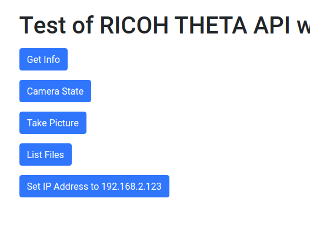

# Simple Node and Express Tests

Examples for 
[tutorial on using the RICOH THETA Wi-Fi API 
with node, express and request](https://community.theta360.guide/t/basic-tutorial-using-node-and-express-to-get-info-from-the-ricoh-theta/4957?u=codetricity).

## Usage

    npm install

### Configure Wi-Fi to Test Client Mode Setup
Create a file `config.js` in the same directory as `index.js`.  Store your 
router SSID and password in this format:

    var config = {
        ssid: "your_wifi_router_ssid",
        password: "your_wifi_router_password"
    };

    module.exports = config;

### Connect Computer to THETA

Refer to the [article](https://community.theta360.guide/t/basic-tutorial-using-node-and-express-to-get-info-from-the-ricoh-theta/4957?u=codetricity) to connect your computer to your THETA.

### Start Server

    node index.js

### Access Web Interface

Go to http://localhost:3000

Press buttons.

Important - Changing the IP address does not change the IP address for AP mode.
It will only change the IP address for client mode. You may need to reboot your camera
after changing the IP address.

### Client Mode

There are some tests for client mode where the THETA uses Digest Authentication.

## Reference

* [RICOH THETA API v2.1](https://api.ricoh/docs/theta-web-api-v2.1/)

